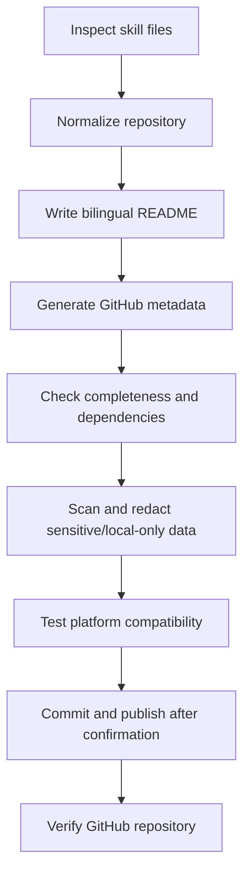

# GitHub-skill-publisher

> Publish an agent skill as a clean, portable, GitHub-ready single-skill repository.

[中文](README.zh.md) · English

GitHub-skill-publisher helps skill authors turn a local agent skill into a polished public repository with clear README copy, correct structure, GitHub metadata, completeness checks, sensitive-data review, compatibility testing, and publish/update workflow support.

---

## Who Is This For?

This skill is designed for:

- Agent skill authors who want to publish a local skill to GitHub.
- Builders who need a repeatable release workflow for README, license, repository structure, dependency checks, compatibility, and sensitive-data review.
- Teams maintaining public or internal skill repositories.

It is less useful if:

- You only need a general Git tutorial.
- You only need a one-off commit or push command.

---

## What It Does

This skill guides the full publishing path for a single agent skill repository: inspect the local skill, normalize the repository structure, write bilingual README files, add release files, generate GitHub repository metadata, check completeness and dependencies, scan for sensitive or local-only information, test compatibility, then create or update the GitHub repository when requested.

---

## When To Use

- You want to publish a local skill as a GitHub repository.
- You want to improve a skill README before public release.
- You want to check whether a skill is complete, portable, dependency-clean, and ready to publish.
- You want to update an existing skill repository without breaking its structure.

---

## Problems It Solves

Publishing skills manually is easy to get wrong: README files become too thin, repository structure drifts, local paths leak into public docs, API keys or account details may appear in examples, licenses are forgotten, GitHub descriptions stay empty, and compatibility claims are unclear. This skill turns those release concerns into a repeatable checklist and writing workflow.

---

## Why Install It?

It helps you:

- Produce README files that explain value, reduce user hesitation, and make installation easy.
- Keep every public skill repository in a clean single-skill structure.
- Catch completeness, dependency, sensitive-data, portability, and platform compatibility issues before publishing.

---

## Capabilities

| Capability | What it handles | Output |
|---|---|---|
| Repository normalization | Single-skill repository layout | Root-level `SKILL.md`, README files, license, and release files |
| README writing | English and Chinese public-facing docs | Product-quality README copy with install, usage, and compatibility sections |
| GitHub metadata | Repository description and optional topics | Clearer GitHub profile cards, search results, and repository lists |
| Completeness checks | Required files, references, templates, scripts, and dependency assumptions | Missing-file and hard-dependency findings before release |
| Sensitive-data review | API keys, user accounts, local paths, private files, logs, and caches | Redaction or replacement before public publishing |
| Release checks | Structure, portability, dependency, sensitive-data, and platform compatibility | Clear pre-publish findings and required fixes |
| GitHub workflow | First publish or later updates | Commit, repository creation or push, and post-publish verification guidance |

---

## Design Principles

This skill is built around a simple publishing model: one skill equals one GitHub repository. The repository root is the skill root.

Advantages:

- It keeps install paths predictable across agents.
- It treats README as both documentation and a conversion page.
- It treats GitHub repository description as part of the public product surface.
- It separates local drafting from remote GitHub synchronization.
- It reports incomplete dependencies or sensitive findings before publishing.

---

## Quick Start

After installing, try this prompt:

```text
Use GitHub-skill-publisher to check whether this local skill is ready to publish to GitHub.
```

Expected result:

```text
A release-readiness review covering repository structure, README quality, GitHub metadata, completeness, dependencies, sensitive-data scan, platform compatibility, portability, Git state, and next steps.
```

---

<!-- Optional: include this section only when the skill has a meaningful process. -->
## Core Workflow



---

## How It Works

The skill uses reference checklists and templates stored in `references/` and `templates/`. It inspects the current skill, applies the single-skill repository rule, drafts public-facing README content, checks that required references and templates exist, identifies hard dependencies on other skills or private resources, scans for sensitive or local-only information, and only proceeds to GitHub actions when the user explicitly asks to sync or publish.

It separates the release process into three layers:

- Public documentation: README files, repository description, install instructions, usage examples, platform compatibility, repository structure, and license.
- Release readiness: required files, referenced assets, dependency assumptions, sensitive-data scan, platform compatibility, portability, Git status, and metadata completeness.
- GitHub actions: repository creation, metadata update, push, and post-publish verification.

---

## Install

GitHub-skill-publisher is published as a single-skill repository. The repository root is the skill root.

Required shape:

```text
GitHub-skill-publisher/
└── SKILL.md
```

### 1. Clone

```bash
git clone https://github.com/chemny/GitHub-skill-publisher.git
```

### 2. Place It In Your Agent's Skills Directory

Copy or symlink the cloned directory into the skills directory used by your agent.

Example:

```text
skills/
└── GitHub-skill-publisher/
    └── SKILL.md
```

### 3. Start A Fresh Agent Session

Many agents scan skill metadata when a new session starts. After installing, open a fresh session so the agent can read `SKILL.md`.

### 4. Verify

Try:

```text
Use GitHub-skill-publisher to review this skill before publishing it to GitHub.
```

### Update

If installed with Git:

```bash
git pull
```

---

## Usage Examples

```text
Use GitHub-skill-publisher to prepare this skill for public GitHub release.
```

```text
Use GitHub-skill-publisher to improve this skill's bilingual README before publishing.
```

```text
Use GitHub-skill-publisher to check whether this skill is compatible with Codex, Claude Code, and OpenClaw.
```

```text
Use GitHub-skill-publisher to scan this skill for API keys, user accounts, local paths, and hard dependencies before publishing.
```

---

## Maintenance

When updating a published skill repository:

- Review `git status` and include only intended files.
- Re-run completeness, dependency, sensitive-data, portability, and compatibility checks when public files change.
- Redact API keys, user account details, private URLs, local paths, logs, caches, and machine-specific assumptions before publishing.
- Report required, optional, adapter-only, or private dependencies before publishing.
- Update GitHub repository description when the README value proposition changes.
- Commit, push, or update GitHub metadata only when the user explicitly asks to sync or publish.

---

## Platform Compatibility

Compatible with Codex, Claude Code, and OpenClaw.

---

## Repository Structure

```text
GitHub-skill-publisher/
├── SKILL.md
├── README.md
├── README.zh.md
├── LICENSE
├── .gitignore
├── evals/
├── references/
└── templates/
```

---

## License

This repository is provided under the MIT License.

Third-party names, platform names, and upstream references remain subject to their original terms.
