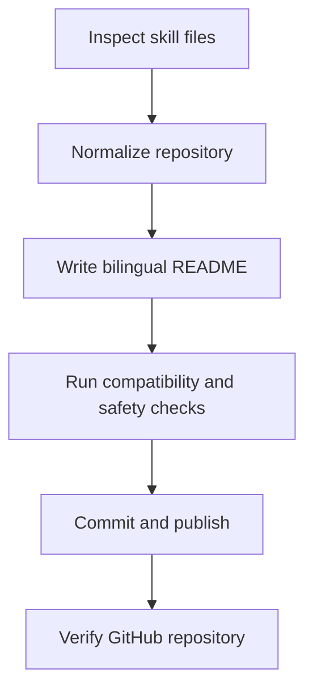

# GitHub-skill-publisher

> Publish an agent skill as a clean, portable, GitHub-ready single-skill repository.

[中文 README](README.zh.md) · English

GitHub-skill-publisher helps skill authors turn a local agent skill into a polished public repository with clear README copy, correct structure, release checks, compatibility review, and safe GitHub publishing steps.

---

## Who Is This For?

This skill is designed for:

- Agent skill authors who want to publish a local skill to GitHub.
- Builders who need a repeatable release workflow for README, license, repository structure, compatibility, and safety checks.
- Teams maintaining public or internal skill repositories.

It is less useful if:

- You only need a general Git tutorial.
- You only need a one-off commit or push command.

---

## What It Does

This skill guides the full publishing path for a single agent skill repository: inspect the local skill, normalize the repository structure, write bilingual README files, add release files, run compatibility and safety checks, then create or update the GitHub repository.

---

## When To Use

- You want to publish a local skill as a GitHub repository.
- You want to improve a skill README before public release.
- You want to check whether a skill is safe, portable, and ready to publish.
- You want to update an existing skill repository without breaking its structure.

---

## Problems It Solves

Publishing skills manually is easy to get wrong: README files become too thin, repository structure drifts, local paths leak into public docs, licenses are forgotten, and compatibility claims are unclear. This skill turns those release concerns into a repeatable checklist and writing workflow.

---

## Why Install It?

It helps you:

- Produce README files that explain value, reduce user hesitation, and make installation easy.
- Keep every public skill repository in a clean single-skill structure.
- Catch portability, safety, and platform compatibility issues before publishing.

---

## Capabilities

| Capability | What it handles | Output |
|---|---|---|
| Repository normalization | Single-skill repository layout | Root-level `SKILL.md`, README files, license, and release files |
| README writing | English and Chinese public-facing docs | Product-quality README copy with install, usage, safety, and compatibility sections |
| Release checks | Structure, portability, security, and platform compatibility | Clear pre-publish findings and required fixes |
| GitHub workflow | First publish or later updates | Commit, repository creation or push, and post-publish verification guidance |

---

## Design Principles

This skill is built around a simple publishing model: one skill equals one GitHub repository. The repository root is the skill root.

Advantages:

- It keeps install paths predictable across agents.
- It treats README as both documentation and a conversion page.
- It separates internal release checks from user-facing README claims.

---

## Quick Start

After installing, try this prompt:

```text
Use GitHub-skill-publisher to check whether this local skill is ready to publish to GitHub.
```

Expected result:

```text
A release-readiness review covering repository structure, README quality, platform compatibility, portability, security, Git state, and next steps.
```

---

<!-- Optional: include this section only when the skill has a meaningful process. -->
## Core Workflow



---

## How It Works

The skill uses reference checklists and templates stored in `references/` and `templates/`. It inspects the current skill, applies the single-skill repository rule, drafts public-facing README content, checks for unsafe or local-only assumptions, and only proceeds to GitHub actions after the release state is clear.

---

## Install

GitHub-skill-publisher is published as a single-skill repository. The repository root is the skill root.

Required shape:

```text
GitHub-skill-publisher/
└── SKILL.md
```

### 1. Clone

```bash
git clone https://github.com/chemny/GitHub-skill-publisher.git
```

### 2. Place It In Your Agent's Skills Directory

Copy or symlink the cloned directory into the skills directory used by your agent.

Example:

```text
skills/
└── GitHub-skill-publisher/
    └── SKILL.md
```

### 3. Start A Fresh Agent Session

Many agents scan skill metadata when a new session starts. After installing, open a fresh session so the agent can read `SKILL.md`.

### 4. Verify

Try:

```text
Use GitHub-skill-publisher to review this skill before publishing it to GitHub.
```

### Update

If installed with Git:

```bash
git pull
```

---

## Usage Examples

```text
Use GitHub-skill-publisher to prepare this skill for public GitHub release.
```

```text
Use GitHub-skill-publisher to improve this skill's bilingual README before publishing.
```

```text
Use GitHub-skill-publisher to check whether this skill is compatible with Codex, Claude Code, and OpenClaw.
```

---

## Platform Compatibility

Compatible with Codex, Claude Code, and OpenClaw.

---

## Safety Boundaries

This skill will not:

- Collect or store credentials, private tokens, cookies, or recovery codes.
- Publish, push, delete, force-push, or modify GitHub repositories without explicit user confirmation.
- Ask users to paste GitHub tokens.
- Claim ownership over third-party content, trademarks, or upstream materials.

GitHub actions use the local GitHub CLI authentication flow when needed.

---

## Repository Structure

```text
GitHub-skill-publisher/
├── SKILL.md
├── README.md
├── README.zh.md
├── LICENSE
├── .gitignore
├── evals/
├── references/
└── templates/
```

---

## License

This repository is provided under the MIT License.

Third-party names, platform names, and upstream references remain subject to their original terms.
