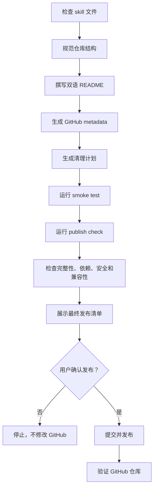

# GitHub-skill-publisher

> 把 agent skill 发布成结构清晰、可安装、适合公开推广的 GitHub 单 skill 仓库。

中文 · [English](README.md)

GitHub-skill-publisher 帮助 skill 作者把本地 agent skill 整理成可公开发布的 GitHub 仓库，包括双语 README、目录结构、协议、GitHub metadata、完整性检查、敏感信息检查、平台兼容性检查，以及 GitHub 发布和更新流程。

---

## 适合谁使用？

这个 skill 适合：

- 想把本地 agent skill 发布到 GitHub 的 skill 作者。
- 需要固定发布流程的人，包括 README、协议、目录结构、依赖检查、兼容性和敏感信息检查。
- 维护公开或内部 skill 仓库的团队。

如果你属于下面情况，它可能不是最合适的工具：

- 你只是想学习 Git 基础命令。
- 你只需要一次性 commit 或 push。

---

## 它能做什么？

它覆盖单 skill 仓库发布的完整路径：检查本地 skill、规范仓库结构、撰写双语 README、补齐发布文件、生成 GitHub 仓库描述、检查完整性和依赖、扫描敏感信息和本地路径、执行平台兼容性检查，然后在用户明确要求时创建或更新 GitHub 仓库。

---

## 什么时候使用？

- 你想把本地 skill 发布成 GitHub 仓库。
- 你想在公开发布前优化 skill README。
- 你想检查某个 skill 是否完整、依赖清晰、可移植、适合发布。
- 你想更新已有 skill 仓库，同时保持结构一致。

---

## 它解决什么问题？

手动发布 skill 很容易出错：README 太薄、目录结构混乱、本地路径泄露、示例里混入 API key 或账号信息、忘记协议、GitHub 仓库描述为空、兼容性说不清楚。这个 skill 把这些发布前问题变成固定检查和写作流程。

---

## 为什么值得安装？

它可以帮你：

- 写出能说明价值、降低用户顾虑、方便安装的 README。
- 让每个公开 skill 仓库保持清晰的单 skill 结构。
- 在发布前发现完整性、依赖、敏感信息、可移植性和平台兼容性问题。

---

## 核心能力

| 能力 | 解决什么问题 | 输出结果 |
|---|---|---|
| 仓库结构规范 | 单 skill 单仓库 | 根目录 `SKILL.md`、README、协议和发布文件 |
| README 写作 | 英文和中文公开文档 | 包含安装、使用、兼容性的产品级 README |
| GitHub metadata | 仓库描述和可选 topics | 更清楚的 GitHub 首页卡片、搜索结果和仓库列表 |
| 完整性检查 | 必需文件、references、templates、scripts 和依赖假设 | 发布前发现缺失文件和强依赖 |
| 敏感信息检查 | API key、用户账号、本地路径、私有文件、日志和缓存 | 发布前脱敏或替换 |
| 发布前检查 | 结构、可移植性、依赖、敏感信息、平台兼容性 | 明确的问题清单和修复建议 |
| GitHub 流程 | 首次发布或后续更新 | commit、创建仓库或 push、发布后验证 |

---

## 设计原理

这个 skill 基于一个简单发布模型：一个 skill 对应一个 GitHub 仓库，仓库根目录就是 skill 根目录。

优势：

- 安装路径更可预测，跨 agent 更容易理解。
- 把 README 当成说明文档和转化页面来写。
- 把 GitHub 仓库描述当成公开产品展示的一部分。
- 把本地草稿和远端 GitHub 同步动作分开处理。
- 在发布前报告缺失依赖和敏感信息问题。

---

## 快速开始

安装后，试试这个 prompt：

```text
Use GitHub-skill-publisher to check whether this local skill is ready to publish to GitHub.
```

预期结果：

```text
得到一份发布前检查，包括仓库结构、README 质量、GitHub metadata、完整性、依赖、敏感信息扫描、平台兼容性、可移植性、Git 状态和下一步建议。
```

---

## 核心流程



---

## 工作原理

这个 skill 使用 `references/` 和 `templates/` 中的检查清单与模板。它会检查当前 skill，应用单 skill 仓库规则，撰写面向公开用户的 README，确认 references 和 templates 是否存在，识别对其他 skill 或私有资源的强依赖，扫描敏感信息和本地路径，并且只有在用户明确要求同步或发布时才进入 GitHub 操作。

它把发布流程分成三层：

- 公开文档：README、仓库描述、安装说明、使用示例、平台兼容性、仓库结构和协议。
- 发布准备：必需文件、引用资源、依赖假设、smoke test、publish check、敏感信息扫描、平台兼容性、可移植性、Git 状态和 metadata 完整度。
- GitHub 动作：创建仓库、更新 metadata、push 和发布后验证。

本地检查脚本只作为报告闸门：

```bash
node scripts/smoke-test.mjs
node scripts/publish-check.mjs
```

它们会检查仓库并生成本地报告，但不会 commit、push、创建仓库、删除文件或修改 GitHub。

---

## 安装

GitHub-skill-publisher 是一个「单 skill 单仓库」。仓库根目录就是 skill 根目录。

必须满足这个结构：

```text
GitHub-skill-publisher/
└── SKILL.md
```

### 1. 克隆仓库

```bash
git clone https://github.com/chemny/GitHub-skill-publisher.git
```

### 2. 放到你的 Agent skills 目录

把克隆下来的目录复制或软链接到你的 Agent skills 目录里。

示例：

```text
skills/
└── GitHub-skill-publisher/
    └── SKILL.md
```

### 3. 开一个新会话

很多 Agent 会在新会话启动时扫描 skill metadata。安装后建议重新开启一个新会话，让 Agent 读取 `SKILL.md`。

### 4. 验证是否生效

输入：

```text
Use GitHub-skill-publisher to review this skill before publishing it to GitHub.
```

### 后续更新

如果你是用 Git 安装的：

```bash
git pull
```

---

## 使用示例

```text
Use GitHub-skill-publisher to prepare this skill for public GitHub release.
```

```text
Use GitHub-skill-publisher to improve this skill's bilingual README before publishing.
```

```text
Use GitHub-skill-publisher to check whether this skill is compatible with Codex, Claude Code, and OpenClaw.
```

```text
Use GitHub-skill-publisher to scan this skill for API keys, user accounts, local paths, and hard dependencies before publishing.
```

---

## 维护方式

更新已发布的 skill 仓库时：

- 先检查 `git status`，只包含预期文件。
- 公开文件变化后，重新执行 smoke test、publish check、完整性、依赖、敏感信息、可移植性和兼容性检查。
- 发布前脱敏 API key、用户账号、私有 URL、本地路径、日志、缓存和机器特定假设。
- 发布前报告 required、optional、adapter-only 或 private 依赖。
- 当 README 价值主张变化时，同步更新 GitHub 仓库描述。
- README 和检查都完成后，先展示最终发布清单。
- 只有用户明确确认最终发布动作后，才执行 commit、push 或 GitHub metadata 更新。

---

## 平台兼容性

兼容 Codex、Claude Code 和 OpenClaw。

---

## 仓库结构

```text
GitHub-skill-publisher/
├── SKILL.md
├── README.md
├── README.zh.md
├── LICENSE
├── .gitignore
├── evals/
├── references/
│   ├── pre-publish-flow.md
│   ├── publish-checklist.md
│   └── ...
├── scripts/
│   ├── smoke-test.mjs
│   └── publish-check.mjs
└── templates/
```

---

## 协议

本仓库使用 MIT License。

第三方名称、平台名称和上游参考资料仍受其原始条款约束。
