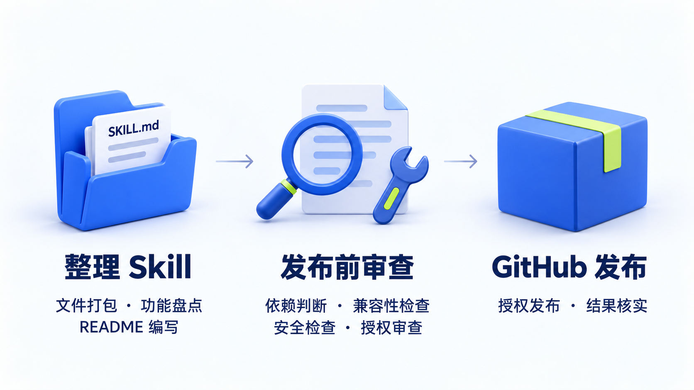

# GitHub Skill Publisher

[English](./README.md) | 中文

## 项目简介

GitHub Skill Publisher 帮你把本地 Skill 整理成可分享的 GitHub 仓库：写好中英文 README，完成发布前审查，处理发现的问题，再按你的授权发布并核实结果。



适合已有 Skill、准备分享给别人，希望理清文件、使用说明和发布问题的作者。默认一个 Skill 对应一个仓库，仓库根目录就是 Skill 的入口。

## 核心功能

| 能力 | 它能帮你做什么 |
|---|---|
| 整理 Skill 仓库 | 理清入口、配套文件和依赖，区分需要分享的内容与本地草稿、缓存。 |
| 编写中英文 README | 先了解 Skill 的主要用途，再说明功能、安装、使用和目录，让用户知道如何开始。 |
| 检查发布准备情况 | 找出缺失文件、坏链接、配图问题、敏感信息和需要确认的署名或授权，给出具体位置。 |
| 发布到 GitHub | 在你明确要求发布后，准备仓库信息、提交并推送，再核实远程结果。需要 GitHub 账号权限。 |
| 修改已有 Skill | 按你的需求修改本地文件，同步受影响的介绍；是否发布由你的指令决定。 |
| 查看工程质量 | 分析结构、复用性和健壮性，帮助安排后续改进；工程分不代表功能已实测或文案易懂。 |

## 安装

### 配置要求

你需要一个能读取 Skills、运行本地命令的 Agent 客户端。先准备基础工具；只有需要操作 GitHub 时，才需要登录账号。

| 项目 | 要求 |
|---|---|
| Agent 客户端 | 例如 Codex 或 Claude Code；实际安装和加载方式由客户端决定。 |
| Node.js | 检查脚本使用 Node.js；项目的检查配置采用 22 版。 |
| Git | 用于查看文件变更、仓库状态和提交记录。 |
| GitHub CLI（按需） | 操作 GitHub 仓库时使用 `gh`，并登录有相应权限的账号。 |

本地检查已在 macOS 上运行。Windows、Linux 和不同 Agent 客户端的实际安装与使用仍需验证；如果你的环境无法完成某一步，Agent 应明确指出原因。详细条件见[兼容性说明](./references/platform-compatibility.md)。

### 快速安装

把下面这句话发给你正在使用的 Agent：

> 帮我安装这个 Skill：https://github.com/chemny/GitHub-skill-publisher 。先检查 Node.js 和 Git，缺少的话帮我补齐基础环境，再安装并确认客户端能找到、加载它。GitHub 登录等到需要发布时再配置。

完成后，让 Agent 告诉你装在哪里、是否能加载，还有哪些条件尚未满足。

## 快速开始

安装后，打开你想分享的 Skill 文件夹，先看看它是否准备好了：

> 帮我检查这个 Skill，看看发布到 GitHub 前还需要改什么。

## 使用示例

### 整理一个准备分享的 Skill

> 这个 Skill 我已经在本地用起来了，帮我整理成一个适合放到 GitHub 上的仓库。

### 把 README 写得容易看懂

> 帮我重写这个 Skill 的中英文 README，让第一次看到的人知道它能做什么、怎么安装和使用。

### 将准备好的 Skill 发布出去

> 把这个 Skill 发布到我的 GitHub，仓库名称就用 Skill 的名字，设为公开。

### 修改后一起发布

> 把 README 的安装说明改清楚，检查通过后同步到 GitHub。

只说“修改”时，Agent 处理本地文件；明确说“修改并发布”时，它在检查通过后继续发布。遇到敏感信息、检查失败、兼容性未核实或仓库目标不明确等问题，会先停下来说明。

### 检查不适合公开的内容

> 帮我看看，这个仓库有没有密钥、私人路径或需要确认授权的内容。

### 找出值得优先改进的地方

> 从工程质量上看看这个 Skill，哪些地方最值得先改？

## 工作原理

Agent 先读取你的 Skill，了解主要用途和现有文件，再整理仓库、编写介绍、运行检查。确认发布条件满足且有明确授权后，才操作 GitHub。

这是一个独立 Skill，没有附带其他子 Skills。它的主要组成如下：

| 组成 | 作用 |
|---|---|
| `SKILL.md` | Agent 的工作入口，定义处理顺序、授权方式和发布边界。 |
| `references/` | 写作、安装、截图、兼容性、安全与发布检查的具体规范。 |
| `templates/` | Standard、Hero、Practical Tool 三套 README，各有中英文版本；分别适合常规介绍、突出开篇展示和需要更多场景说明的实用工具。也包含许可、忽略文件和内部审阅记录模板。 |
| `scripts/` | 提供发布准备检查、工程质量分析，以及 Publisher 自身的文件和模板检查。 |
| `evals/` | 保存检查场景和回归案例，供维护时验证规则。 |
| `examples/` | 已确认的 README 配图参考案例，区分可复用做法与本产品的具体选择。 |

不同检查各有用途：

- **发布准备检查**：针对当前项目，检查文档、文件、安全与 Git 状态，生成 `publish-check-report.json`。结果分为通过、需审阅和阻断；报告里的工程卫生分不等于发布许可。
- **工程质量分析**：生成 `se-quality-report.json`，把可直接核验的项目与估算建议区分开；用来补充发布检查，不能替代它。
- **Publisher 自身检查**：验证本 Skill 的配套文件、模板和检查工具，生成 `smoke-test-report.json`；它不能证明其他 Skill 的功能正常，其他项目仍需自己的测试。

检查工具会写入本地报告；提交、推送和创建 GitHub 仓库由 Agent 按授权执行。自动检查之后，README 的用途、示例、双语事实和配图范围仍需人工审阅。

## 目录结构

```text
GitHub-skill-publisher/
├── SKILL.md                 # Agent 工作入口
├── references/              # 写作与发布规范
├── templates/               # 三套双语 README 及配套模板
├── scripts/                 # 检查工具与测试
├── evals/                   # 检查案例
├── assets/                  # README 能力示意图
├── examples/                # 已确认的配图参考案例
├── .github/workflows/       # 自动检查配置
├── .gitignore               # 本地文件忽略规则
├── README.md                # 英文介绍
├── README.zh.md             # 中文介绍
└── LICENSE                  # 许可
```

安装时需要保留 `SKILL.md` 及它引用的规范、模板和工具，不能只复制入口文件。检查产生的报告不属于必需的安装内容：发布检查和工程分析报告写到被检查的项目，Publisher 自身检查报告写到本 Skill 目录。

更多细节：[README 写作规范](./references/readme-style.md)、[文案审阅方法](./references/readme-review.md)、[检查器覆盖范围](./references/readme-checks.md)、[配图参考案例](./examples/readme-visual/publisher-capability.md)、[GitHub 操作流程](./references/github-workflow.md)。

## 许可

本项目采用 [MIT License](./LICENSE)。引用的第三方材料、商标及上游内容仍遵守各自的授权条件。

## 关于我

作者：美名 Neo，AI 实战派独立开发者。

有 AI 学习与应用方面的需求，欢迎与我联系！
