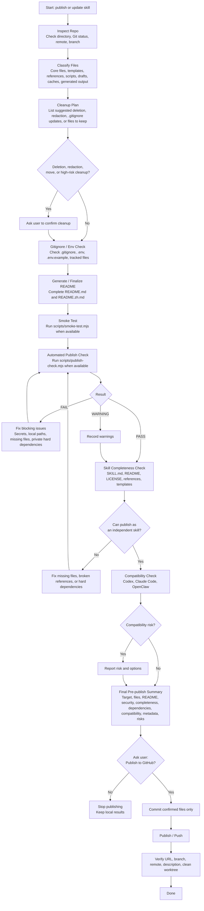

# Pre-publish Flow

Use this flow before publishing a new skill repository or pushing an update to an existing public skill repository.

## Flow

## Confirmation gates

High-risk cleanup confirmation:

- Ask before deleting files, moving files, redacting content, or changing generated output that may be useful to the user.
- Do not treat `.gitignore` as enough. Check tracked files with Git because ignored files can already be committed.

Final publish confirmation:

- After all content, including README files, has been generated and checked, list the final publish summary.
- Ask the user explicitly whether to publish to GitHub.
- Only `commit`, `push`, `sync`, `gh repo create`, or `gh repo edit` after the user clearly confirms the publish action.

## Final pre-publish summary

Include:

- Target repository, remote URL, branch, and visibility.
- Files that will be committed or published.
- README status, including whether README files are complete and aligned.
- Security result: secrets, API keys, tokens, accounts, local paths, private files, logs, and caches.
- Completeness result: `SKILL.md`, README files, `LICENSE`, references, templates, scripts, and assets.
- Dependency result: other skills, private directories, unpublished scripts, and platform-specific assumptions.
- Compatibility result for Codex, Claude Code, and OpenClaw.
- GitHub metadata: repository description, license, and topics when useful.
- Warnings, failures, and remaining risks.
