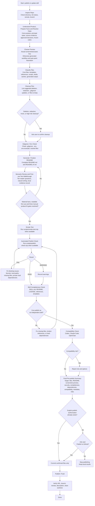

# Pre-publish Flow

For identity/attribution confirmation, [review-decisions.md](review-decisions.md) takes precedence over blanket “ask the user” instructions below: reuse unchanged scoped explicit approvals and ask only about new/changed findings. Reuse is not publication authorization; a current publication hold must be respected.

Use this flow before publishing a new skill repository or pushing an update to an existing public skill repository.

## README preparation and acceptance

Use [readme-style.md](readme-style.md) as the single framework authority. Before writing, establish an evidence-based product brief with main/supporting tasks and a representative first use; inspect actual capabilities, required versus optional dependencies, user inputs, complete sub-Skill inventory, installation contents, files, rights and available approved visuals. Resolve missing consequential facts rather than inventing them.

Write the current product introduction under the default ten-section framework, with Preview second and About Me last. As allowed by readme-style.md, a labelled generated capability illustration may be folded into Overview without a separate Preview heading; keep the remaining section order and duties. Keep history, upgrades, migrations and internal development records in other documents. For updates, change current product facts rather than appending a version announcement to the README.

Review both languages for information completeness and reader understanding, then run available objective checks. Report semantic conclusions separately from checker PASS/WARNING/FAIL and engineering scores. If templates or automation still reflect older rules, manually check against the authority and disclose the coverage gap.

For a controlled before/after writing evaluation, first agree dimensions and a 10-point rubric, preserve the original and revised case outputs and source evidence, then score both against the same rubric. Do not generate or score a comparative result before its proposal and dimensions are agreed. This writing review does not authorize publication.

Follow [readme-review.md](readme-review.md) and fill [the internal review record](../templates/readme-review-record.md). Establish facts with current file/line evidence, handle missing author/visual facts without filler, freeze any comparison rubric before edits, and review the ten reader questions plus first-use text walkthrough before automated checks. Keep review fields out of public prose.

## Flow

```mermaid
flowchart TD
    A["Start: publish or update skill"] --> B["Inspect Repo<br/>Check directory, Git status, remote, branch"]
    B --> B1["Understand Product, Prepare Facts and Resolve Gaps<br/>Core purpose, principal tasks, source evidence, approved decisions, frozen rubric"]
    B1 --> C0["Choose Preview<br/>Actual screenshots/cases first<br/>Otherwise generated workflow and pain-point illustration"]
    C0 --> C["Classify Files<br/>Core files, templates, references, scripts, drafts, caches, generated output"]
    C --> D["Cleanup Plan<br/>List suggested deletion, redaction, .gitignore updates, or files to keep"]
    D --> E{"Deletion, redaction,<br/>move, or high-risk cleanup?"}
    E -- "Yes" --> F["Ask user to confirm cleanup"]
    E -- "No" --> G["Gitignore / Env Check"]
    F --> G
    G["Gitignore / Env Check<br/>Check .gitignore, .env, .env.example, tracked files"] --> H["Generate / Finalize README<br/>Complete README.md and README.zh.md"]
    H --> H1["Semantic Review and First-use Text Walkthrough<br/>Ten reader questions, natural writing, local evidence record"]
    H1 --> H2{"Material facts, readable first use and three manual product-fit gates resolved?"}
    H2 -- "No" --> H
    H2 -- "Yes" --> I0["Smoke Test<br/>Run scripts/smoke-test.mjs when available"]
    I0 --> I["Automated Publish Check<br/>Run scripts/publish-check.mjs when available"]
    I --> J{"Result"}
    J -- "FAIL" --> K["Fix blocking issues<br/>Secrets, local paths, missing files, private hard dependencies"]
    K --> I
    J -- "WARNING" --> L["Record warnings"]
    J -- "PASS" --> M["Skill Completeness Check"]
    L --> M
    M["Skill Completeness Check<br/>SKILL.md, README, LICENSE, references, templates"] --> N{"Can publish as<br/>an independent skill?"}
    N -- "No" --> O["Fix missing files, broken references, or hard dependencies"]
    O --> I
    N -- "Yes" --> P["Compatibility Check<br/>Codex, Claude Code, OpenClaw"]
    P --> Q{"Compatibility risk?"}
    Q -- "Yes" --> R["Report risk and options"]
    Q -- "No" --> S["Final Pre-publish Summary"]
    R --> S
    S["Final Pre-publish Summary<br/>Target, files, README, screenshot preview, security, completeness, dependencies, compatibility, metadata, risks"] --> A1{"Explicit publish authorization<br/>already exists?"}
    A1 -- "Yes" --> V["Commit confirmed files only"]
    A1 -- "No" --> T{"Ask user:<br/>Publish to GitHub?"}
    T -- "No" --> U["Stop publishing<br/>Keep local results"]
    T -- "Yes" --> V
    V --> W["Publish / Push"]
    W --> X["Verify URL, branch, remote, description, clean worktree"]
    X --> Y["Done"]
```

## Confirmation gates

High-risk cleanup confirmation:

- Ask before deleting files, moving files, redacting content, or changing generated output that may be useful to the user.
- Do not treat `.gitignore` as enough. Check tracked files with Git because ignored files can already be committed.

Final publish authorization:

- After all content, including README files and any screenshot asset, has been generated and checked, list the final publish summary.
- Show the selected actual screenshot/case or generated workflow illustration before final publish authorization, reusing approval for unchanged images. If images are omitted, report the concrete reason from each README; never silently waive the image requirement because the Skill has no UI. See [readme-visuals.md](readme-visuals.md).
- Ask the user explicitly whether to publish to GitHub when the current request did not already include explicit publish authorization.
- If the user already said "修改并发布", "更新并同步到 GitHub", or equivalent edit-plus-publish wording, run checks and publish after success without a second confirmation.
- Only `commit`, `push`, `sync`, `gh repo create`, or `gh repo edit` when explicit publish authorization exists.
- Apply this authorization gate to every skill repository, not only to GitHub-skill-publisher itself.

## Final pre-publish summary

Include:

- Target repository, remote URL, branch, and visibility.
- Files that will be committed or published.
- README status, including whether README files are complete and aligned.
- Preview status: selected form (actual screenshot/case or generated illustration), path, source or prompt/rationale, accurate scope, and user approval. Generated illustrations do not verify execution.
- Security result: secrets, API keys, tokens, accounts, local paths, private files, logs, and caches.
- Third-party/copyright review: third-party names, platform names, copyright notices, trademark notices, upstream references, and license-limit notes that require a user decision.
- Identity/attribution metadata review: author names, maintainer names, private emails, personal usernames, social handles, generator/tool watermarks, and Git commit author/signature metadata that require a user decision.
- Completeness result: `SKILL.md`, README files, `LICENSE`, references, templates, scripts, and assets.
- Dependency result: other skills, private directories, unpublished scripts, and platform-specific assumptions.
- Runtime compatibility result for Codex, Claude Code, and OpenClaw.
- OS compatibility result for required targets macOS and Windows, including any Windows-specific requirements or limitations. Linux is optional unless the user, repository, or documented runtime explicitly requires it.
- GitHub metadata: repository description and license.
- Warnings, failures, and remaining risks.
