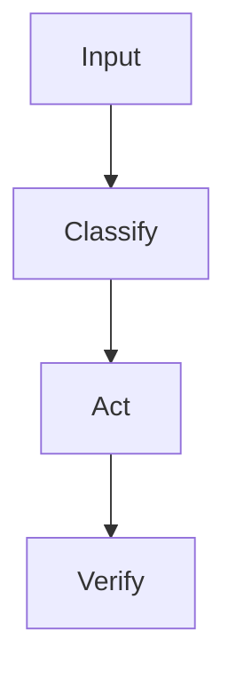

# README Style

Use a product-quality README, not a bare technical note.

A public skill README is both documentation and a conversion page. Its job is to help readers understand the product value, trust the mechanism, and complete their first successful use with minimal friction.

Do not use hype. Do actively explain what the skill improves and how the reader can try it quickly.

Also generate a GitHub repository description. GitHub shows this one-line description on profile cards, search results, and repository lists, so it must explain the skill's value before a reader opens the README.

Use English as the default GitHub repository description language, because `README.md` is English by default and GitHub profile cards should match the repository homepage. Use Chinese only when the user explicitly requests a Chinese or China-facing repository.

Create both:

```text
README.md      English, default GitHub repository homepage
README.zh.md   Chinese
```

Each README must link to the other near the top with an explicit language switch.

Default language switch:

```markdown
English | [中文](./README.zh.md)
```

```markdown
[English](./README.md) | 中文
```

Use only the language names in the switch labels: `中文` and `English`. Do not write `中文 README`, `English README`, or any label that includes the word `README`; it is visually redundant on GitHub.

## README language quality gate

This is a required pre-publish check.

- `README.md` must be English-first because GitHub displays it by default.
- `README.zh.md` must be Chinese-only except for the intentional language label/link.
- Do not use a mixed bilingual body in either README by default.
- Do not solve missing Chinese documentation by putting Chinese paragraphs into the English README.
- If the user explicitly requests a single bilingual README, confirm that choice before publishing.
- If both README files exist, verify their first screen links to each other before publishing.
- If either language file is missing or obviously thin compared with the other, stop and fix it before publishing.

## README structure quality gate

This is a required pre-publish check for publisher-managed releases.

The default README template is not only a reference example. It is the release structure standard. A repository can pass the language gate and still fail release readiness if the README does not explain the product well enough.

Before publishing or republishing a skill:

- Evaluate existing README files against the current default structure.
- Do not blindly overwrite an older README, because it may contain useful project-specific details.
- If the user did not explicitly ask to preserve the current README as-is, upgrade missing key modules before publishing.
- If the user explicitly asks for a pass-through release, keep the existing README structure, report it as a warning when incomplete, and do not claim it follows the current template.
- Do not publish only because `README.md` is English and `README.zh.md` exists. Language layout is necessary but not sufficient.

Required structure modules:

- audience and value opening: who should use the skill and why it matters,
- install path: how to install or import the skill,
- first-use path: quick start, verification prompt, or first successful command,
- program or page screenshot: a real screenshot captured by the agent when the skill has a visual surface,
- core capabilities: what the skill can actually do,
- requirements or configuration: dependencies, credentials, environment, or setup assumptions,
- platform compatibility: Codex, Claude Code, OpenClaw, or a concise compatibility sentence,
- repository/file structure: enough for users to understand what is included,
- license: MIT by default unless the user requests another license.

Product-page quality gates:

- Core capabilities must be easy for a normal user to scan. Prefer a two-column table: `Capability` + `What it helps you do` (Chinese: `能力` + `它能帮你做什么`). Do not use three-column implementation tables such as `能力 / 处理内容 / 输出结果`, `Capability / Input / Output`, or `Capability / What it handles / Output` as the main capability table.
- README copy must describe the public product, not the authoring conversation. Remove internal collaboration wording such as "after asking", "with your consent", "add this rule to your prompt/instructions", "rerun setup", "征得你同意", "加进提示词", or "重跑 setup". Product docs can say what the installer does and what result the user gets, but should not narrate our back-and-forth or expose implementation chores as user work.

Root-cause rule from the `ai-image-generator` case: a README can still be incomplete if it was only normalized for language layout. Future publisher-managed releases must either upgrade it to the current README structure or explicitly report the preserved structure as pass-through.

## Release surface normalization policy

Old projects may still use the legacy layout:

```text
README.md      Chinese
README.en.md   English
```

GitHub-skill-publisher uses publisher-managed release by default. A publisher-managed release must normalize the public release surface before publishing:

```text
README.md      English, GitHub default
README.zh.md   Chinese
GitHub description: English by default
```

Default behavior:

- Legacy `README.md` Chinese + `README.en.md` English is a release-surface mismatch.
- Migrate the release surface before publishing.
- `publish-check.mjs` fails this mismatch by default.

Pass-through exception:

- If the user explicitly says to preserve the old README, not migrate README, or publish the current files as-is, keep the old layout.
- In pass-through releases, report the old layout as a warning and run `node scripts/publish-check.mjs --allow-legacy-readme`.

When GitHub repository description is updated, use English by default even if a pass-through release temporarily retains old README files.

## README style variants

Use the Standard high-conversion structure by default. It is the safest choice for most public skill repositories because it helps users quickly understand, trust, install, and use the skill without reading implementation details first.

Standard is not a traditional technical README. It is a user-facing product README. Its default decision path is:

```text
What is this product?
How does it solve it?
How do I install and use it?
```

The default Standard section order is:

```text
1. Title
2. Language switch
3. Audience-and-value opening
4. Program or Page Screenshot
5. Who Is This For?
6. What It Does
7. Core Capabilities
8. Platform Compatibility
9. One-command Install / Install
10. Quick Start
11. Usage Examples
12. How It Works
13. Repository Structure
14. Requirements
15. License
```

Standard writing rules:

- Lead with audience and user value, not feature inventory or repository structure.
- The opening should name the target users, the manual/fragmented work being replaced, the durable result created, and the downstream work it enables.
- Put platform compatibility before installation so users know whether the skill fits their agent runtime before they install it.
- Put installation before quick start, and keep quick start as a single section.
- Use short, concept-dense language.
- Prefer user-facing results over internal file names.
- Sort core capabilities by real user importance, from highest to lowest. Do not list them by implementation order unless that order matches user value.
- In Chinese READMEs, quick-start prompts and usage examples must be written in Chinese. In English READMEs, quick-start prompts and usage examples must be written in English.
- Installation must be one copy-ready natural-language request addressed to the current Agent and include the public repository URL.
- Do not expose `git clone`, directory copying, platform-specific skill paths, manual installation, dependency commands, or restart instructions in the default README install flow. The installing Agent owns those decisions and reports the verified result.
- Provide a copy-ready prompt for direct use.
- Put deeper CLI details in usage examples or reference docs, not in the main README unless the command is part of first successful use.
- Include a program or page screenshot section whenever the skill has a visual surface. Use a real screenshot captured by the agent:
  - for a web page, open the page in a browser and capture the page;
  - for a desktop/app program, launch the real program and capture the UI;
  - insert the screenshot near the top of both `README.md` and `README.zh.md`;
  - store the image in the repository, usually under `assets/`;
  - before publishing, show the screenshot to the user and wait for confirmation.
- Do not use a mock screenshot when a real page or program can be opened. If real user data should not be exposed, use safe sample data while keeping the real UI, and state that clearly in the final pre-publish summary.
- Move technical details, long configuration matrices, and repository internals behind the main value path or into references/docs.

Use the hero badge structure when the user wants a more promotional first screen or when the skill has strong product positioning. This style uses a centered opening block, shields.io badges, a bold value statement, quick navigation links, and language links.

Available templates:

```text
templates/README.md           Standard English README, GitHub default
templates/README.zh.md        Standard Chinese README
templates/README.practical-tool.md     Practical utility English README for rule/checklist/example-heavy skills
templates/README.practical-tool.zh.md  Practical utility Chinese README for rule/checklist/example-heavy skills
templates/README.hero.md      Hero/badge English README
templates/README.hero.zh.md   Hero/badge Chinese README
```

Full README reference example:

```text
references/readme-full-agent-evolution.md
```

Do not let the hero block replace substantive documentation. After the hero block, keep the same core sections: audience fit, what it does, capabilities, platform compatibility, install, quick start, usage examples, how it works, structure, requirements, and license.

Use the practical utility structure when a skill is more useful as a manual or rulebook than as a short product page. This pattern works well for rewriting tools, review tools, lint/check tools, prompt tools, and skills with many examples or detectable patterns.

Practical utility structure:

```text
1. Title
2. Language switch
3. Optional source/adaptation statement
4. Project overview
5. Installation
6. Installation verification
7. Basic usage
8. Usage scenarios with input/output examples
9. Detected patterns, rule categories, or capability taxonomy
10. File guide
11. Manual workflow
12. Key principles
13. Before/after example comparison
14. Warning list, checklist, or FAQ
15. Contribution
16. References
17. License
18. Final usage note
```

This structure was inspired by the public README of `op7418/Humanizer-zh`, which is effective because it combines installation, direct usage, concrete scenarios, rule categories, manual workflow, example comparison, references, and license in a single readable document.

## Required baseline

Every public skill README should quickly answer:

- what this skill does,
- who it is for,
- what capabilities it provides,
- what its practical advantages are,
- how to install it,
- how to verify it works,
- how to use it,
- what it looks like when it has a page or program UI,
- whether it supports Codex, Claude Code, and OpenClaw,
- what the repository contains,
- what license and copyright limits apply.

If the user does not specify a license, use MIT.

For Standard READMEs, answer these baseline questions through the user decision path rather than a long technical checklist. Do not force sections like `Repository Structure`, `Capabilities`, or `Usage Examples` into the top-level README when they make the page feel slower or more technical than needed.

## Repository description

Create a concise GitHub repository description for every published skill.

Rules:

- Keep it to one sentence.
- Use English by default.
- Prefer 80-140 English characters, or 35-80 Chinese characters when the user explicitly requests Chinese.
- Explain what the skill does and why it matters.
- Avoid generic text such as "Agent skill", "README", or only the repository name.
- Do not use unsupported compatibility or security claims.
- Match the first-screen value proposition in `README.md`.

Useful patterns:

```text
Publish local agent skills as clean, installable, promotion-ready single-skill GitHub repositories.
```

```text
Package a local skill with README, license, safety checks, and compatibility review for GitHub release.
```

## Conversion principle

Write the README to reduce three kinds of friction:

- comprehension friction: what is this, who is it for, and why does it matter?
- trust friction: how does it work, what are the boundaries, and is it safe to use?
- action friction: how can the reader install it, verify it, and get the first useful result quickly?

The first screen should make the value proposition clear before the reader scrolls. Prefer concrete benefits over broad claims:

- save time,
- reduce repeated manual work,
- improve consistency,
- lower operational risk,
- make a workflow easier to reuse,
- make expert behavior easier to trigger.

Use comparison carefully. It is acceptable to explain why the skill is better than ad hoc prompting or manual steps, but avoid attacking other tools or making unsupported claims.

## Audience fit section

Audience fit is required, but it does not need a separate `Who Is This For?` section. Put it in the opening value paragraph by default so readers immediately understand whether the skill is relevant to them.

Include two parts:

- target users: the people, roles, or teams the skill is designed for,
- target workflows: the situations where the skill is useful.

Use concrete language. Avoid generic statements such as "for anyone who uses AI." A good audience statement should qualify the reader and reduce wrong expectations.

## README depth

Choose the smallest README structure that explains the skill clearly.

Use the Standard high-conversion README by default:

```text
1. Title
2. Language switch
3. Audience-and-value opening
4. Who Is This For?
5. What It Does
6. Core Capabilities
7. Platform Compatibility
8. Install
9. Quick Start
10. Usage Examples
11. How It Works
12. Repository Structure
13. Requirements
14. License
```

Use a fuller README only when the skill truly needs more detail, but keep the same top-level reading path:

```text
1. Title
2. Language switch
3. Audience-and-value opening
4. Who Is This For?
5. What It Does
6. Core Capabilities
7. Platform Compatibility
8. Install
9. Quick Start
10. Usage Examples
11. How It Works
12. Repository Structure
13. Requirements
14. License
```

Omit a limitations section by default.

## Tone

Write clearly and practically. Avoid hype.

The README should explain:

- why this skill exists,
- what real pain it solves,
- who should install it,
- what outcome the user can expect after installation,
- what it can do,
- how it works,
- what design choices make it useful,
- what advantages it has over ad hoc prompting or manual work,
- why the mechanism is trustworthy, when that is not obvious,
- how to install and use it.

## First successful use

Every README should include a short path to the first useful result. This can be a `Quick Start`, `Try It`, or a prominent verification example.

The first-use path should include:

- the simplest install step, ideally one line,
- a copy-ready prompt or command to run,
- what success looks like,
- where to go next for normal usage.

## Diagrams

Prefer Mermaid for GitHub-native rendering.

Use a core workflow diagram when the skill has a meaningful process. Do not add a diagram just to fill a template.



ASCII diagrams are acceptable for compact mechanisms:

```text
Signal -> Triage -> Route -> Store -> Validate -> Promote -> Prune
```

## Install section

Read `references/install-section.md` before writing the installation section.

The Standard README should ask the current Agent to install the public repository URL. This is the complete default installation flow:

```text
Install this Skill for me:
https://github.com/owner/repo
```

The Chinese README should use the equivalent Chinese request. The README may add one short result sentence: the Agent will choose the installation method for the current client, check dependencies, and verify that the Skill loads.

Do not add a default manual-install section. Do not list skill directories, `git clone`, copy/move steps, dependency commands, or restart instructions. If installation fails, the current Agent should diagnose the real environment interactively instead of making every reader scan hypothetical fallback steps.

Only add a manual installation section when the user explicitly requests it or the repository is intentionally designed for a non-Agent audience.

## Design philosophy section

This section is optional. Add it only when the broader engineering idea helps users understand why the skill works or when the skill explicitly builds on a known method.

For agent/context skills, it is acceptable to cite public context-engineering ideas such as:

- Andrej Karpathy's Software 2.0 / Software 3.0 / LLM OS framing.
- Anthropic's context engineering articles.
- LangChain's context engineering articles.
- Tobi Lutke's "context engineering over prompt engineering" framing.

Be careful:

- Say "inspired by" or "borrows the engineering lens".
- Do not imply endorsement, affiliation, or participation.
- Add a disclaimer when naming public figures or companies.
- Do not let references displace practical installation and usage guidance.

## Forbidden top-level README sections

Standard skill READMEs must not include top-level `Update`, `Updating`, `Publish`, `Publishing`, `Maintenance`, `更新`, `更新方式`, `维护`, or `发布` sections.

Keep update, release, publishing, and maintenance/dev-workflow instructions inside the publisher workflow, release checklist, `CONTRIBUTING`, or internal references. The target skill README should stay focused on what the product is, what pain it solves, how it works, how to install it, and how to use it.

## Repository structure section

Include a repository structure section for public skill repositories. Generate the tree from actual files. Do not imply that `references/`, `scripts/`, `adapters/`, or `evals/` are required when they are not present.

## Platform compatibility section

For public release, evaluate compatibility with Codex, Claude Code, and OpenClaw before publishing. Also evaluate operating-system compatibility with macOS and Windows when the skill includes scripts, installers, path handling, shell commands, browser automation, filesystem operations, or external CLIs. Linux compatibility is optional unless the user, repository, or documented runtime explicitly requires it.

In the README, keep platform compatibility user-facing and concise. Use one sentence that names the compatible platforms.

```markdown
Compatible with Codex, Claude Code, and OpenClaw.
```

Do not put internal testing statuses such as `Supported`, `Partial`, `Unsupported`, or `Not tested` in the README unless the user explicitly asks for a detailed compatibility matrix. Keep those statuses in the pre-publish report to the user.

## License and copyright section

Use the heading `License`. Include an explicit license section. If the user does not specify a license, use MIT and state that the repository is provided under the MIT License. Put copyright, third-party content, trademark, and upstream reference notes inside this section instead of using a separate heading. Do not claim that bundled third-party content, public references, brand names, or upstream materials are relicensed unless that is true.

Before publishing, treat third-party names, platform names, copyright notices, trademark notices, upstream references, and external license-limit notes as review items. Do not remove them automatically. List the findings and let the user decide whether to keep them, rewrite them, add attribution, or remove them.

## README quality checklist

- The first screen explains value clearly.
- The first screen gives a reason to install or try the skill.
- The intended user is clear.
- The audience fit statement names target users and target workflows.
- Capabilities are scannable.
- The README reduces comprehension, trust, and action friction.
- There is a short first-success path.
- Examples are copy-pasteable.
- Platform compatibility with Codex, Claude Code, and OpenClaw is tested where possible and stated accurately.
- OS compatibility with macOS and Windows is tested or reviewed when the skill has runtime scripts, installers, shell commands, path assumptions, filesystem behavior, or external CLIs; missing macOS or Windows validation is reported before publishing. Linux is optional unless explicitly required.
- Repository structure matches actual files.
- Installation assumes a public GitHub repo.
- MIT is used when the user has not requested another license.
- No personal local paths remain.
- No user-specific memory files are referenced.
