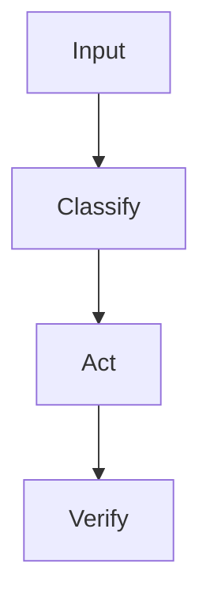

# README Style

Use a product-quality README, not a bare technical note.

A public skill README is both documentation and a conversion page. Its job is to help readers understand the product value, trust the mechanism, and complete their first successful use with minimal friction.

Do not use hype. Do actively explain why the skill is worth installing, what it improves, and how the reader can try it quickly.

Also generate a GitHub repository description. GitHub shows this one-line description on profile cards, search results, and repository lists, so it must explain the skill's value before a reader opens the README.

Create both:

```text
README.md      English
README.zh.md   Chinese
```

Each README must link to the other near the top with an explicit language switch.

Default language switch:

```markdown
[中文](./README.zh.md) | English
```

```markdown
中文 | [English](./README.md)
```

## README language quality gate

This is a required pre-publish check.

- `README.md` must be English-only except for the intentional language label/link.
- `README.zh.md` must be Chinese-first and must not contain copied English sections except proper nouns, commands, file paths, code, repository names, or technical terms.
- Do not use a mixed bilingual body in `README.md` by default.
- Do not solve missing Chinese documentation by putting Chinese paragraphs into the English README.
- If the user explicitly requests a single bilingual README, confirm that choice before publishing.
- If both README files exist, verify their first screen links to each other before publishing.
- If either language file is missing or obviously thin compared with the other, stop and fix it before publishing.

## README style variants

Use the standard structure by default. It is the safest choice for most public skill repositories because it is clear, easy to scan, and familiar to GitHub users.

Use the hero badge structure when the user wants a more promotional first screen or when the skill has strong product positioning. This style uses a centered opening block, shields.io badges, a bold value statement, quick navigation links, and language links.

Available templates:

```text
templates/README.md           Standard English README
templates/README.zh.md        Standard Chinese README
templates/README.hero.md      Hero/badge English README
templates/README.hero.zh.md   Hero/badge Chinese README
```

Do not let the hero block replace substantive documentation. After the hero block, keep the same core sections: audience fit, problems solved, capabilities, design principles, quick start, install, usage, platform compatibility, structure, and license.

## Required baseline

Every public skill README should quickly answer:

- what this skill does,
- who it is for,
- what problem it solves,
- why it is worth installing,
- what capabilities it provides,
- what design principles or mechanism it uses,
- what its practical advantages are,
- how to install it,
- how to verify it works,
- how to use it,
- whether it supports Codex, Claude Code, and OpenClaw,
- what the repository contains,
- what license and copyright limits apply.

If the user does not specify a license, use MIT.

## Repository description

Create a concise GitHub repository description for every published skill.

Rules:

- Keep it to one sentence.
- Prefer 80-140 characters.
- Explain what the skill does and why it matters.
- Avoid generic text such as "Agent skill", "README", or only the repository name.
- Do not use unsupported compatibility or security claims.

Useful patterns:

```text
Publish agent skills as clean, portable, GitHub-ready single-skill repositories.
```

```text
Turn local agent skills into polished GitHub repositories with README, license, safety, and compatibility checks.
```

## Conversion principle

Write the README to reduce three kinds of friction:

- comprehension friction: what is this, who is it for, and why does it matter?
- trust friction: how does it work, what are the boundaries, and is it safe to use?
- action friction: how can the reader install it, verify it, and get the first useful result quickly?

The first screen should make the value proposition clear before the reader scrolls. Prefer concrete benefits over broad claims:

- save time,
- reduce repeated manual work,
- improve consistency,
- lower operational risk,
- make a workflow easier to reuse,
- make expert behavior easier to trigger.

Use comparison carefully. It is acceptable to explain why the skill is better than ad hoc prompting or manual steps, but avoid attacking other tools or making unsupported claims.

## Audience fit section

`Who Is This For?` is required. It should help readers quickly decide whether the skill is relevant to them.

Include three parts:

- target users: the people, roles, or teams the skill is designed for,
- target workflows: the situations where the skill is useful,
- non-target cases: when the skill is less useful or not the right tool.

Use concrete language. Avoid generic statements such as "for anyone who uses AI." A good audience section should qualify the reader and reduce wrong expectations.

## README depth

Choose the smallest README structure that explains the skill clearly.

Use a baseline README for simple skills. Baseline does not mean thin; it means no unnecessary workflow diagrams, maintenance mechanism, or conceptual references.

```text
1. Title
2. One-sentence value proposition
3. Language switch link
4. Who Is This For?
5. What It Does
6. Problems It Solves
7. Why Install It?
8. Capabilities
9. Design Principles
10. Quick Start
11. Install
12. Platform Compatibility
13. Usage Examples
14. Repository Structure
15. License
```

Use a full README for complex or public-facing skills:

```text
1. Title
2. One-sentence value proposition
3. Language switch link
4. Who Is This For?
5. What It Does
6. When To Use
7. Problems It Solves
8. Why Install It?
9. Capabilities
10. Design Principles
11. Core Workflow, if the skill has a real process
12. How It Works
13. Quick Start
14. Install
15. Platform Compatibility
16. Usage Examples
17. Maintenance, if the skill has a real update or maintenance mechanism
18. Repository Structure
19. License
```

Omit a limitations section by default.

## Tone

Write clearly and practically. Avoid hype.

The README should explain:

- why this skill exists,
- what real pain it solves,
- who should install it,
- what outcome the user can expect after installation,
- what it can do,
- how it works,
- what design choices make it useful,
- what advantages it has over ad hoc prompting or manual work,
- why the mechanism is trustworthy, when that is not obvious,
- how to install and use it.

## First successful use

Every README should include a short path to the first useful result. This can be a `Quick Start`, `Try It`, or a prominent verification example.

The first-use path should include:

- the minimum install step,
- the prompt or command to run,
- what success looks like,
- where to go next for normal usage.

## Diagrams

Prefer Mermaid for GitHub-native rendering.

Use a core workflow diagram when the skill has a meaningful process. Do not add a diagram just to fill a template.



ASCII diagrams are acceptable for compact mechanisms:

```text
Signal -> Triage -> Route -> Store -> Validate -> Promote -> Prune
```

## Install section

Read `references/install-section.md` before writing the installation section.

The install section should not only say "git clone". It should explain:

- single-skill repository structure,
- `SKILL.md` at repository root,
- where to place or symlink the directory,
- why a fresh agent session may be needed,
- a short verification prompt,
- how to update later.

## Design philosophy section

This section is optional. Add it only when the broader engineering idea helps users understand why the skill works or when the skill explicitly builds on a known method.

For agent/context skills, it is acceptable to cite public context-engineering ideas such as:

- Andrej Karpathy's Software 2.0 / Software 3.0 / LLM OS framing.
- Anthropic's context engineering articles.
- LangChain's context engineering articles.
- Tobi Lutke's "context engineering over prompt engineering" framing.

Be careful:

- Say "inspired by" or "borrows the engineering lens".
- Do not imply endorsement, affiliation, or participation.
- Add a disclaimer when naming public figures or companies.
- Do not let references displace practical installation and usage guidance.

## Update or maintenance section

This section is optional. Include it only when the skill has a real update, validation, promotion, pruning, adapter, or maintenance mechanism.

For ordinary skills, omit it or use a short `Maintenance` section only if there are concrete instructions.

## Repository structure section

Include a repository structure section for public skill repositories. Generate the tree from actual files. Do not imply that `references/`, `scripts/`, `adapters/`, or `evals/` are required when they are not present.

## Platform compatibility section

For public release, evaluate compatibility with Codex, Claude Code, and OpenClaw before publishing.

In the README, keep platform compatibility user-facing and concise. Use one sentence that names the compatible platforms.

```markdown
Compatible with Codex, Claude Code, and OpenClaw.
```

Do not put internal testing statuses such as `Supported`, `Partial`, `Unsupported`, or `Not tested` in the README unless the user explicitly asks for a detailed compatibility matrix. Keep those statuses in the pre-publish report to the user.

## License and copyright section

Use the heading `License`. Include an explicit license section. If the user does not specify a license, use MIT and state that the repository is provided under the MIT License. Put copyright, third-party content, trademark, and upstream reference notes inside this section instead of using a separate heading. Do not claim that bundled third-party content, public references, brand names, or upstream materials are relicensed unless that is true.

## README quality checklist

- The first screen explains value clearly.
- The first screen gives a reason to install or try the skill.
- The problem statement is concrete.
- The intended user is clear.
- The `Who Is This For?` section names target users, target workflows, and non-target cases.
- Capabilities are scannable.
- Design principles and practical advantages are explicit.
- The README reduces comprehension, trust, and action friction.
- There is a short first-success path.
- Diagrams explain the workflow when the skill is process-oriented.
- Examples are copy-pasteable.
- Platform compatibility with Codex, Claude Code, and OpenClaw is tested where possible and stated accurately.
- Repository structure matches actual files.
- Installation assumes a public GitHub repo.
- MIT is used when the user has not requested another license.
- No personal local paths remain.
- No user-specific memory files are referenced.
