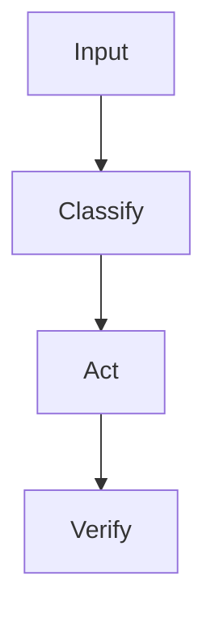

# README Style

Use a product-quality README, not a bare technical note.

A public skill README is both documentation and a conversion page. Its job is to help readers understand the product value, trust the mechanism, and complete their first successful use with minimal friction.

Do not use hype. Do actively explain why the skill is worth installing, what it improves, and how the reader can try it quickly.

Also generate a GitHub repository description. GitHub shows this one-line description on profile cards, search results, and repository lists, so it must explain the skill's value before a reader opens the README.

Use Chinese as the default GitHub repository description language, because `README.md` is Chinese by default and GitHub profile cards should match the repository homepage. Use English only when the user explicitly requests an English or international-facing repository.

Create both:

```text
README.md      Chinese, default GitHub repository homepage
README.en.md   English
```

Each README must link to the other near the top with an explicit language switch.

Default language switch:

```markdown
中文 | [English](./README.en.md)
```

```markdown
[中文](./README.md) | English
```

Use only the language names in the switch labels: `中文` and `English`. Do not write `中文 README`, `English README`, or any label that includes the word `README`; it is visually redundant on GitHub.

## README language quality gate

This is a required pre-publish check.

- `README.md` must be Chinese-first because GitHub displays it by default.
- `README.en.md` must be English-only except for the intentional language label/link.
- Do not use a mixed bilingual body in either README by default.
- Do not solve missing Chinese documentation by putting Chinese paragraphs into the English README.
- If the user explicitly requests a single bilingual README, confirm that choice before publishing.
- If both README files exist, verify their first screen links to each other before publishing.
- If either language file is missing or obviously thin compared with the other, stop and fix it before publishing.

## README style variants

Use the Standard high-conversion structure by default. It is the safest choice for most public skill repositories because it helps users quickly understand, trust, install, and use the skill without reading implementation details first.

Standard is not a traditional technical README. It is a user-facing product README. Its default decision path is:

```text
What is this product?
What user pain does it solve?
How does it solve it?
How do I install and use it?
```

The default Standard section order is:

```text
1. Title
2. Language switch
3. One-sentence value proposition
4. What It Is
5. What Problem It Solves
6. Product Highlights
7. Workflow
8. Preview, optional
9. One-Line Install
10. Use It Directly
11. Default Configuration
12. What You Get
13. Compatibility
14. License
```

Standard writing rules:

- Lead with user value, not repository structure.
- Explain pain and outcome before inputs, outputs, schemas, dependencies, or implementation details.
- Use short, concept-dense language.
- Prefer user-facing results over internal file names.
- Make installation as close to one command as practical.
- Provide a copy-ready prompt for direct use.
- Include a Mermaid workflow for process-oriented skills.
- Include a preview image section only when real screenshots, cover images, first-frame previews, UI images, or other persuasive visuals are available.
- Move technical details, long configuration matrices, and repository internals behind the main value path or into references/docs.

Use the hero badge structure when the user wants a more promotional first screen or when the skill has strong product positioning. This style uses a centered opening block, shields.io badges, a bold value statement, quick navigation links, and language links.

Available templates:

```text
templates/README.md           Standard Chinese README, GitHub default
templates/README.en.md        Standard English README
templates/README.practical-tool.md     Practical utility Chinese README for rule/checklist/example-heavy skills
templates/README.practical-tool.en.md  Practical utility English README for rule/checklist/example-heavy skills
templates/README.hero.md      Hero/badge English README
templates/README.hero.zh.md   Hero/badge Chinese README
```

Full README reference example:

```text
references/readme-full-agent-evolution.md
```

Do not let the hero block replace substantive documentation. After the hero block, keep the same core sections: audience fit, problems solved, capabilities, design principles, quick start, install, usage, platform compatibility, structure, and license.

Use the practical utility structure when a skill is more useful as a manual or rulebook than as a short product page. This pattern works well for rewriting tools, review tools, lint/check tools, prompt tools, and skills with many examples or detectable patterns.

Practical utility structure:

```text
1. Title
2. Language switch
3. Optional source/adaptation statement
4. Project overview
5. Installation
6. Installation verification
7. Basic usage
8. Usage scenarios with input/output examples
9. Detected patterns, rule categories, or capability taxonomy
10. File guide
11. Manual workflow
12. Key principles
13. Before/after example comparison
14. Warning list, checklist, or FAQ
15. Contribution
16. References
17. License
18. Final usage note
```

This structure was inspired by the public README of `op7418/Humanizer-zh`, which is effective because it combines installation, direct usage, concrete scenarios, rule categories, manual workflow, example comparison, references, and license in a single readable document.

## Required baseline

Every public skill README should quickly answer:

- what this skill does,
- who it is for,
- what problem it solves,
- why it is worth installing,
- what capabilities it provides,
- what design principles or mechanism it uses,
- what its practical advantages are,
- how to install it,
- how to verify it works,
- how to use it,
- whether it supports Codex, Claude Code, and OpenClaw,
- what the repository contains,
- what license and copyright limits apply.

If the user does not specify a license, use MIT.

For Standard READMEs, answer these baseline questions through the user decision path rather than a long technical checklist. Do not force sections like `Repository Structure`, `Capabilities`, or `Usage Examples` into the top-level README when they make the page feel slower or more technical than needed.

## Repository description

Create a concise GitHub repository description for every published skill.

Rules:

- Keep it to one sentence.
- Use Chinese by default.
- Prefer 35-80 Chinese characters, or 80-140 English characters when the user explicitly requests English.
- Explain what the skill does and why it matters.
- Avoid generic text such as "Agent skill", "README", or only the repository name.
- Do not use unsupported compatibility or security claims.
- Match the first-screen value proposition in `README.md`.

Useful patterns:

```text
把本地 agent skill 发布成结构清晰、可安装、适合公开推广的 GitHub 单 skill 仓库。
```

```text
把本地 skill 整理成带 README、协议、安全检查和兼容性检查的 GitHub 仓库。
```

## Conversion principle

Write the README to reduce three kinds of friction:

- comprehension friction: what is this, who is it for, and why does it matter?
- trust friction: how does it work, what are the boundaries, and is it safe to use?
- action friction: how can the reader install it, verify it, and get the first useful result quickly?

The first screen should make the value proposition clear before the reader scrolls. Prefer concrete benefits over broad claims:

- save time,
- reduce repeated manual work,
- improve consistency,
- lower operational risk,
- make a workflow easier to reuse,
- make expert behavior easier to trigger.

Use comparison carefully. It is acceptable to explain why the skill is better than ad hoc prompting or manual steps, but avoid attacking other tools or making unsupported claims.

## Audience fit section

`Who Is This For?` is required. It should help readers quickly decide whether the skill is relevant to them.

Include three parts:

- target users: the people, roles, or teams the skill is designed for,
- target workflows: the situations where the skill is useful,
- non-target cases: when the skill is less useful or not the right tool.

Use concrete language. Avoid generic statements such as "for anyone who uses AI." A good audience section should qualify the reader and reduce wrong expectations.

## README depth

Choose the smallest README structure that explains the skill clearly.

Use the Standard high-conversion README by default:

```text
1. Title
2. Language switch
3. One-sentence value proposition
4. What It Is
5. What Problem It Solves
6. Product Highlights
7. Workflow
8. Preview, optional
9. One-Line Install
10. Use It Directly
11. Default Configuration
12. What You Get
13. Compatibility
14. License
```

Use a fuller README only when the skill truly needs more detail:

```text
1. Title
2. One-sentence value proposition
3. Language switch link
4. Who Is This For?
5. What It Does
6. When To Use
7. Problems It Solves
8. Why Install It?
9. Capabilities
10. Design Principles
11. Core Workflow, if the skill has a real process
12. How It Works
13. Quick Start
14. Install
15. Platform Compatibility
16. Usage Examples
17. Maintenance, if the skill has a real update or maintenance mechanism
18. Repository Structure
19. License
```

Omit a limitations section by default.

## Tone

Write clearly and practically. Avoid hype.

The README should explain:

- why this skill exists,
- what real pain it solves,
- who should install it,
- what outcome the user can expect after installation,
- what it can do,
- how it works,
- what design choices make it useful,
- what advantages it has over ad hoc prompting or manual work,
- why the mechanism is trustworthy, when that is not obvious,
- how to install and use it.

## First successful use

Every README should include a short path to the first useful result. This can be a `Quick Start`, `Try It`, or a prominent verification example.

The first-use path should include:

- the simplest install step, ideally one line,
- a copy-ready prompt or command to run,
- what success looks like,
- where to go next for normal usage.

## Diagrams

Prefer Mermaid for GitHub-native rendering.

Use a core workflow diagram when the skill has a meaningful process. Do not add a diagram just to fill a template.



ASCII diagrams are acceptable for compact mechanisms:

```text
Signal -> Triage -> Route -> Store -> Validate -> Promote -> Prune
```

## Install section

Read `references/install-section.md` before writing the installation section.

The Standard README should prefer one-line installation when practical. Avoid making first-time users run `cd`, `git clone`, and another `cd` as separate steps when one copyable command can do the job.

The install section should still make these facts clear:

- single-skill repository structure,
- `SKILL.md` at repository root,
- where to place or symlink the directory,
- why a fresh agent session may be needed,
- a short verification prompt,
- how to update later.

If details would slow the README down, keep the Standard section short and move deeper installation variants into references/docs.

## Design philosophy section

This section is optional. Add it only when the broader engineering idea helps users understand why the skill works or when the skill explicitly builds on a known method.

For agent/context skills, it is acceptable to cite public context-engineering ideas such as:

- Andrej Karpathy's Software 2.0 / Software 3.0 / LLM OS framing.
- Anthropic's context engineering articles.
- LangChain's context engineering articles.
- Tobi Lutke's "context engineering over prompt engineering" framing.

Be careful:

- Say "inspired by" or "borrows the engineering lens".
- Do not imply endorsement, affiliation, or participation.
- Add a disclaimer when naming public figures or companies.
- Do not let references displace practical installation and usage guidance.

## Forbidden top-level README sections

Standard skill READMEs must not include top-level `Update`, `Updating`, `Publish`, `Publishing`, `更新`, `更新方式`, or `发布` sections.

Keep update, release, and publishing instructions inside the publisher workflow, release checklist, or internal references. The target skill README should stay focused on what the product is, what pain it solves, how it works, how to install it, and how to use it.

## Repository structure section

Include a repository structure section for public skill repositories. Generate the tree from actual files. Do not imply that `references/`, `scripts/`, `adapters/`, or `evals/` are required when they are not present.

## Platform compatibility section

For public release, evaluate compatibility with Codex, Claude Code, and OpenClaw before publishing.

In the README, keep platform compatibility user-facing and concise. Use one sentence that names the compatible platforms.

```markdown
Compatible with Codex, Claude Code, and OpenClaw.
```

Do not put internal testing statuses such as `Supported`, `Partial`, `Unsupported`, or `Not tested` in the README unless the user explicitly asks for a detailed compatibility matrix. Keep those statuses in the pre-publish report to the user.

## License and copyright section

Use the heading `License`. Include an explicit license section. If the user does not specify a license, use MIT and state that the repository is provided under the MIT License. Put copyright, third-party content, trademark, and upstream reference notes inside this section instead of using a separate heading. Do not claim that bundled third-party content, public references, brand names, or upstream materials are relicensed unless that is true.

## README quality checklist

- The first screen explains value clearly.
- The first screen gives a reason to install or try the skill.
- The problem statement is concrete.
- The intended user is clear.
- The `Who Is This For?` section names target users, target workflows, and non-target cases.
- Capabilities are scannable.
- Design principles and practical advantages are explicit.
- The README reduces comprehension, trust, and action friction.
- There is a short first-success path.
- Diagrams explain the workflow when the skill is process-oriented.
- Examples are copy-pasteable.
- Platform compatibility with Codex, Claude Code, and OpenClaw is tested where possible and stated accurately.
- Repository structure matches actual files.
- Installation assumes a public GitHub repo.
- MIT is used when the user has not requested another license.
- No personal local paths remain.
- No user-specific memory files are referenced.
