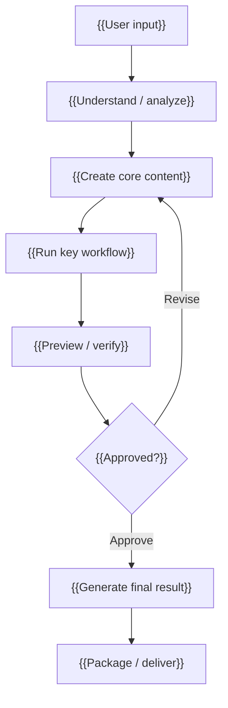

# {{Skill Name}}

[中文](./README.md) | English

{{One-sentence value proposition: explain what this skill turns into what useful result.}}

## What It Is

{{Explain the product positioning in 2-3 short sentences. Write for first-time users, not maintainers.}}

It is not {{non-target-1}}, and it is not {{non-target-2}}. Its core job is to {{core-job}}.

## What Problem It Solves

{{Use 4-6 bullets to name the user's real pain. Keep this practical and concrete.}}

- {{Pain point 1}}
- {{Pain point 2}}
- {{Pain point 3}}
- {{Pain point 4}}
- {{Pain point 5, optional}}

## Product Highlights

{{Use dense, high-signal bullets. Each item should explain why the skill is worth installing.}}

- **{{Highlight 1}}**: {{One-sentence explanation}}
- **{{Highlight 2}}**: {{One-sentence explanation}}
- **{{Highlight 3}}**: {{One-sentence explanation}}
- **{{Highlight 4}}**: {{One-sentence explanation}}
- **{{Highlight 5, optional}}**: {{One-sentence explanation}}

## Workflow



{{Explain the workflow in 1-2 sentences. Do not expand into implementation details.}}

<!-- Optional: show this section only when the repository has screenshots, cover images, first-frame previews, UI images, or other persuasive visuals.
## Preview


-->

## One-Line Install

```bash
{{one-line-install-command}}
```

After installation, start a fresh agent session so it can reload the skill.

## Use It Directly

```text
{{A copy-ready prompt the user can paste into Codex, Claude Code, OpenClaw, or another compatible agent.}}
```

{{Optional next-step prompt after approval or confirmation.}}

## Default Configuration

{{Only include the configuration users must know. Keep provider lists and environment variables short.}}

- {{Default behavior 1}}
- {{Default behavior 2}}
- {{Optional provider or integration 1}}
- {{Optional provider or integration 2}}
- Keep real credentials in local environment variables or a private `.env`; never commit them.

## What You Get

{{Describe the final result in user-facing language before listing files or artifacts.}}

```text
{{result-1}}     {{Short explanation}}
{{result-2}}     {{Short explanation}}
{{result-3}}     {{Short explanation}}
{{result-4}}     {{Short explanation}}
```

{{One-sentence final value summary.}}

## Compatibility

```text
Codex: {{Supported / Tested / Designed to support / Not tested}}
Claude Code: {{Supported / Tested / Designed to support / Not tested}}
OpenClaw: {{Supported / Tested / Designed to support / Not tested}}
```

Do not claim full compatibility for platforms that have not been tested.

## License

MIT
