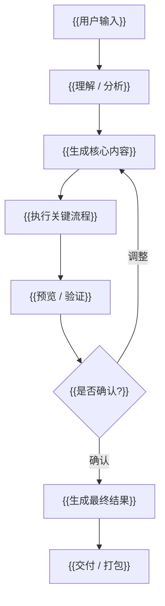

# {{Skill Name}}

中文 | [English](./README.en.md)

{{一句话价值：用一句话说明这个 skill 能把什么问题变成什么有用结果。}}

## 它是什么

{{用 2-3 句说明产品定位。写给第一次看到项目的用户，不要写给维护者。}}

它不是 {{非目标 1}}，也不是 {{非目标 2}}。它的核心作用是：{{核心作用}}。

## 它解决什么问题

{{用 4-6 个 bullet 打中用户真实痛点。少讲技术，多讲困扰。}}

- {{痛点 1}}
- {{痛点 2}}
- {{痛点 3}}
- {{痛点 4}}
- {{痛点 5，可选}}

## 产品特色

{{用高密度短句说明为什么值得安装。}}

- **{{特色 1}}**：{{一句话解释}}
- **{{特色 2}}**：{{一句话解释}}
- **{{特色 3}}**：{{一句话解释}}
- **{{特色 4}}**：{{一句话解释}}
- **{{特色 5，可选}}**：{{一句话解释}}

## 整体流程



{{用 1-2 句话解释流程，不展开实现细节。}}

<!-- 可选：只有当仓库有截图、封面、首帧预览、界面图或其他能增强说服力的图片时才展示这一节。
## 效果预览


-->

## 一行安装

```bash
{{one-line-install-command}}
```

安装后，重新打开一个 agent 会话，让它重新加载 skill。

## 直接使用

```text
{{给用户一段可以直接复制到 Codex、Claude Code、OpenClaw 或其他兼容 agent 里的使用 prompt。}}
```

{{可选：需要确认或继续执行时，补一句下一步指令。}}

## 默认配置

{{只写用户必须知道的配置。供应商列表和环境变量要保持简短。}}

- {{默认能力 1}}
- {{默认能力 2}}
- {{可选供应商或集成 1}}
- {{可选供应商或集成 2}}
- 真实密钥只放在本地环境变量或私有 `.env` 中，不要提交到仓库。

## 最终你会得到

{{先用用户能理解的语言描述最终结果，再列文件或交付物。}}

```text
{{结果 1}}     {{简短说明}}
{{结果 2}}     {{简短说明}}
{{结果 3}}     {{简短说明}}
{{结果 4}}     {{简短说明}}
```

{{一句话总结最终交付价值。}}

## 兼容性

```text
Codex: {{已支持 / 已实测 / 设计上支持 / 未实测}}
Claude Code: {{已支持 / 已实测 / 设计上支持 / 未实测}}
OpenClaw: {{已支持 / 已实测 / 设计上支持 / 未实测}}
```

不要给未实测平台写“完全兼容”。

## 许可证

MIT
