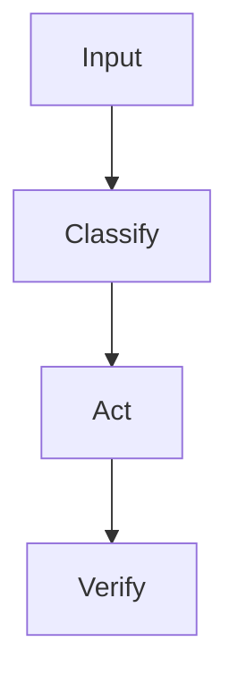

# [Skill Name]

> [One-sentence value proposition.]

[中文 README](README.zh.md) · English

[Short positioning paragraph: what this skill is and who it is for.]

---

## Who Is This For?

This skill is designed for:

- [Target user or role 1]
- [Target user or role 2]
- [Target workflow or team scenario]

It is less useful if:

- [Non-target use case or wrong expectation]

---

## What It Does

[Explain the concrete job this skill performs.]

---

## When To Use

- [Use case 1]
- [Use case 2]
- [Use case 3]

---

## Problems It Solves

[Explain the real user pain this skill removes. Keep this practical.]

---

## Why Install It?

[Explain why this skill is worth installing instead of handling the task manually or with ad hoc prompting.]

It helps you:

- [Benefit 1: save time, reduce repeated work, improve consistency, lower risk, or make a workflow reusable]
- [Benefit 2]
- [Benefit 3]

---

## Capabilities

| Capability | What it handles | Output |
|---|---|---|
| [Capability] | [Input/context] | [Result] |

---

## Design Principles

[Explain the core design choices behind this skill.]

Advantages:

- [Advantage 1]
- [Advantage 2]
- [Advantage 3]

---

## Quick Start

After installing, try this prompt:

```text
[First successful use prompt]
```

Expected result:

```text
[What success looks like]
```

---

<!-- Optional: include this section only when a broader engineering idea helps users understand the skill.
## Design Philosophy

[Explain the design ideas, references, and why the approach is trustworthy. Avoid implying endorsement.]

---
-->

<!-- Optional: include this section only when the skill has a meaningful process.
## Core Workflow



---
-->

<!-- Optional: include this section for full READMEs when the skill needs deeper mechanism explanation.
## How It Works

[Explain the working mechanism.]

---
-->

<!-- Optional: include only when the skill has a real update, validation, promotion, pruning, adapter, or maintenance mechanism.
## Maintenance

[Explain concrete maintenance or update instructions.]

---
-->

## Install

[Skill Name] is published as a single-skill repository. The repository root is the skill root.

Required shape:

```text
[repo]/
└── SKILL.md
```

### 1. Clone

```bash
git clone https://github.com/[owner]/[repo].git
```

### 2. Place It In Your Agent's Skills Directory

Copy or symlink the cloned directory into the skills directory used by your agent.

Example:

```text
skills/
└── [repo]/
    └── SKILL.md
```

### 3. Start A Fresh Agent Session

Many agents scan skill metadata when a new session starts. After installing, open a fresh session so the agent can read `SKILL.md`.

### 4. Verify

Try a short prompt that should trigger this skill:

```text
[Verification prompt]
```

### Update

If installed with Git:

```bash
git pull
```

---

## Usage Examples

```text
[Example prompt]
```

---

## Platform Compatibility

Compatible with Codex, Claude Code, and OpenClaw.

---

## Safety Boundaries

This skill will not:

- [Collect or store sensitive information, credentials, tokens, or private files]
- [Publish, push, delete, or modify external systems without explicit user confirmation]
- [Claim ownership over third-party content, trademarks, or upstream materials]

[Add any required user confirmation, permission, or local-only behavior notes.]

---

## Repository Structure

```text
[repo]/
├── SKILL.md
├── README.md
├── README.zh.md
└── LICENSE
```

---

## License

This repository is provided under the MIT License unless a different license is explicitly stated.

MIT

[Add any copyright, third-party content, trademark, or upstream reference notes here. Do not claim rights over third-party materials.]
