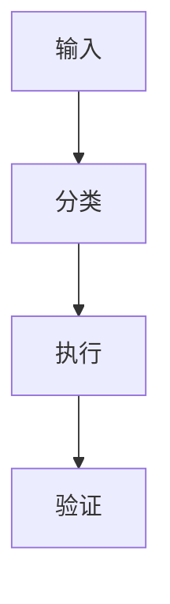

# [Skill Name]

> [一句话价值主张。]

中文 · [English](README.md)

[简短定位：这个 skill 是什么，适合谁使用。]

---

## 适合谁使用？

这个 skill 适合：

- [目标用户或角色 1]
- [目标用户或角色 2]
- [目标工作流或团队场景]

如果你属于下面情况，它可能不是最合适的工具：

- [不适合的使用场景或错误预期]

---

## 它能做什么？

[说明这个 skill 具体完成什么任务。]

---

## 什么时候使用？

- [使用场景 1]
- [使用场景 2]
- [使用场景 3]

---

## 它解决什么问题？

[说明它解决的真实用户痛点，保持具体。]

---

## 为什么值得安装？

[说明为什么值得安装这个 skill，而不是继续手动处理或临时写 prompt。]

它可以帮你：

- [收益 1：节省时间、减少重复劳动、提升一致性、降低风险，或让流程可复用]
- [收益 2]
- [收益 3]

---

## 核心能力

| 能力 | 解决什么问题 | 输出结果 |
|---|---|---|
| [能力] | [输入/场景] | [结果] |

---

## 设计原理

[说明这个 skill 背后的核心设计选择。]

优势：

- [优势 1]
- [优势 2]
- [优势 3]

---

## 快速开始

安装后，试试这个 prompt：

```text
[首次成功体验 prompt]
```

预期结果：

```text
[成功时应该看到什么]
```

---

<!-- 可选：只有当更大的工程思想有助于用户理解这个 skill 时才保留。
## 设计思想

[说明背后的设计思路和参考来源。注意不要暗示被引用对象参与或背书。]

---
-->

<!-- 可选：只有当这个 skill 有明确流程时才保留。
## 核心流程



---
-->

<!-- 可选：完整版 README 中，如果需要更深入解释机制，再保留这一节。
## 工作原理

[解释机制。]

---
-->

<!-- 可选：只有当这个 skill 有真实的更新、验证、晋升、清理、适配器或维护机制时才保留。
## 维护方式

[说明具体的维护或更新方式。]

---
-->

## 安装

[Skill Name] 是一个「单 skill 单仓库」。仓库根目录就是 skill 根目录。

必须满足这个结构：

```text
[repo]/
└── SKILL.md
```

### 1. 克隆仓库

```bash
git clone https://github.com/[owner]/[repo].git
```

### 2. 放到你的 Agent skills 目录

把克隆下来的目录复制或软链接到你的 Agent skills 目录里。

示例：

```text
skills/
└── [repo]/
    └── SKILL.md
```

### 3. 开一个新会话

很多 Agent 会在新会话启动时扫描 skill metadata。安装后建议重新开启一个新会话，让 Agent 读取 `SKILL.md`。

### 4. 验证是否生效

输入一个应该触发该 skill 的短 prompt：

```text
[验证 prompt]
```

### 后续更新

如果你是用 Git 安装的：

```bash
git pull
```

---

## 使用示例

```text
[示例 prompt]
```

---

## 平台兼容性

兼容 Codex、Claude Code 和 OpenClaw。

---

## 仓库结构

```text
[repo]/
├── SKILL.md
├── README.md
├── README.zh.md
└── LICENSE
```

---

## 协议

默认使用 MIT License，除非本仓库明确声明了其他协议。

[在这里补充版权、第三方内容、商标或上游参考来源说明。不要把第三方材料说成自己的版权内容。]
